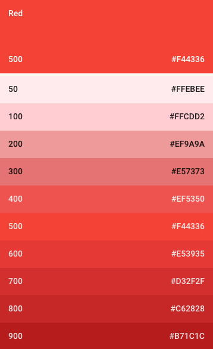
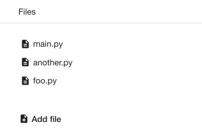
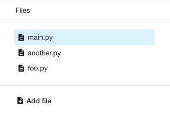

When building bigger applications, we always strive for flexibility, extensibility and reusability. This applies not only to the actual application logic, but also to style sheets. Especially nowadays, where things like [CSS variables](https://developers.google.com/web/updates/2016/02/css-variables-why-should-you-care) and [modules](https://github.com/css-modules/css-modules) exist. These tools are great and they solve many different problems in a very elegant way. However, one thing that's still super hard to do these days is **theming**. Being able to use existing, or create new components, but easily changing their look and feel without changing their code. This is often required when we build things that can be reused across different projects, or if the project we're working on should simply enable the user to change the color scheme.

The [Angular Material](http://material.angular.io) project comes with a built-in story for theming, including using any of Material Design's own **predefined themes**, but also creating custom themes that will be used not only by components provided by Angular Material, but also our own custom ones.

In this article we'll explore how theming is implemented, how pre-built themes can be used and how we can make our own custom components theme-able so they pick up the configured theme as well!

<div class="thtrm-toc is-sticky" markdown="1">
### TABLE OF CONTENTS
{:.no_toc}
* TOC
{:toc}
</div>

## What is a theme?

"Theme" can mean many different things to different people, so it's good to clarify what a theme in the context of Angular Material means. Let's get right into it.

The [official theming guide](https://github.com/angular/material2/blob/master/guides/theming.md) is pretty much to the point here:

> A theme is a set of colors that will be applied to the Angular Material components.

To be more specific, a theme is a **composition of color palettes**. That's right, not just a single color palette, multiple color palettes. While this might sound unnecessary first, it turns out that this is a very powerful setup to define themes in a very flexible way.

Alright, but what color palettes are needed to compose a theme? As for Angular Material, it boils down to five different color palettes with each being used for different parts of the design:

- **Primary** - Main colors most widely used across all screens and components.
- **Accent** - Also known as the secondary color. Used for floating action buttons and interactive elements.
- **Warn** - Colors to convey error state.
- **Foreground** - Used for text and icons.
- **Background** - Colors used for element backgrounds.

If you want to dive deeper into the whole color usuability story in Material Design, we recommend checking out the [Material Design Specification for colors](https://material.io/guidelines/style/color.html#color-usability), as it describes the topic in very deep detail.

## Using pre-built themes

As mentioned earlier, Angular Material already comes with a set of pre-built themes that can be used right out of the box. Available pre-built themes are: `deeppurple-amber`, `indigo-pink`, `pink-bluegrey` and `purple-green`.

Using them is as easy as including or importing the dedicated CSS file that comes with all Angular Material builds. So assuming we've installed Angular Material in our **Angular CLI** project using:

```sh
$ yarn|npm install --save @angular/material
```

We can go ahead and add any of the pre-built CSS files to our global styles by configuring our `.angular-cli.json` accordingly:


```json
{
  ...
  "styles": [
    "../node_modules/@angular/material/prebuilt-themes/indigo-pink.css",
    "styles.scss"
  ]
  ...
}
```

Or, if we don't want to fiddle around in our `angular-cli.json` file, we can also import any pre-built theme right into the projects `styles.scss` file like this:

```scss
@import '../node_modules/@angular/material/prebuilt-themes/indigo-pink.css';
```

We can easily try it out by having our application using Angular Material components. So first we add `MaterialModule` to our `AppModule`'s imports:

```js
import { MaterialModule } from '@angular/material';

@NgModule({
  imports: [
    ...
    MaterialModule
  ],
  ...
})
export class AppModule {}
```

Then we go ahead and render, for example, Angular Material's tool bar component:

```js
@Component({
  selector: 'my-app',
  template: `
    <md-toolbar>Awesome toolbar</md-toolbar>
  `
})
export class AppComponent {}
```


Looks cool right? Another thing that's worth mentioning is that some Material components offer properties to configure whether they use the current theme's primary, accent or warn color:

```html
<md-toolbar color="primary">Awesome toolbar</md-toolbar>
```


## Custom theme using built-in color palettes

Alright, using pre-built themes is a pretty cool thing as we get good looking components right away without doing any serious work. Let's talk about how to create a **custom theme** using Angular Material's predefined color palettes.

In order to create a custom theme, we need to do a couple of things:

- **Generate core styles** - These are theme independent styles, including styles for elevation levels, ripple effects, styles for accessibility and overlays
- **Primary color palette** - Generate color palette for the theme's primary color
- **Accent color palette** - Generate color palette for the theme's accent color
- **Warn color palette** - Generate color palette for the theme's warn color
- **Theme generation** - Given the color palettes we generated, we create a theme, which can be used by Angular Material, or custom components

While this looks like a lot of work, it turns out Angular Material gives us many tools to make these tasks a breeze. Let's start off by creating a new `custom-theme.scss` file and import it in our root `styles.scss` instead of the pre-built theme. After that we'll go through the list step by step:

```scss
@import './custom-theme';
```

### Generate core styles

This is a pretty easy one. Angular Material provides many very powerful SCSS mix-ins that do all the ground work for us. The mix-in that generates Material's core styles is called `mat-core`. All we have to do is to import and call it.

Here's what that looks like (custom-theme.scss):

```scss
@import '../node_modules/@angular/material/theming';

@include mat-core();
```

### Generate color palettes

The next thing we need to do is to generate color palettes, which can then be composed to an actual theme. To generate a color palette, we can use Angular Material's `mat-palette` mix-in. `mat-palette` takes a **base palette** (yes, that's another palette, more on that in a second), and returns a new palette that comes with Material specific [hue color values](https://en.wikipedia.org/wiki/Hue) for "light", "dark" and "contrast" colors of the given base palette.

But what is this base palette? The base palette is just another color palette that compromises primary and accent colors of a single color. Wait, this sounds super confusing! Let's take Material Design's red color palette as an example:



Here we see all color codes for lighter and darker versions of the color red, as part of the Material Design specification. The values 50 - 900 represent the hue values or the "strength" of the color, or how light or dark it is. 500 is the recommended value for a theme's primary color. There are much more defined color palettes and they are very nicely documented [right here](https://material.io/guidelines/style/color.html#color-color-palette).

So now that we know what a base palette is, we need to figure out how to create such a thing. Do we have to define and write them ourselves? The answer is yes and no. If we want to use our own custom color palettes, we need to define them manually. However, if we want to use any of Material Design colors, Angular Material comes with predefined palette definitions for all of them! If we take a quick look at the source code, we can see how to palette for the color red is implemented:

```scss
$mat-red: (
  50: #ffebee,
  100: #ffcdd2,
  200: #ef9a9a,
  300: #e57373,
  400: #ef5350,
  500: #f44336,
  600: #e53935,
  700: #d32f2f,
  800: #c62828,
  900: #b71c1c,
  A100: #ff8a80,
  A200: #ff5252,
  A400: #ff1744,
  A700: #d50000,
  contrast: (
    50: $black-87-opacity,
    100: $black-87-opacity,
    200: $black-87-opacity,
    300: $black-87-opacity,
    400: $black-87-opacity,
    500: white,
    600: white,
    700: white,
    800: $white-87-opacity,
    900: $white-87-opacity,
    A100: $black-87-opacity,
    A200: white,
    A400: white,
    A700: white,
  )
);
```

It's basically just a map where each key (tone value) maps to a color code. So if we ever want to define our own custom color palette, this is what it could look like.

Okay, let's create a palette for our primary, accent and warn colors. All we have to do is to call the `mat-palette` mix-in with a base color palette. Let's use `$mat-light-blue` for primary, `$mat-orange` for accent and `$mat-red` for warn colors. We can simply reference these variables because we imported Angular Material's theming capabilities in the previous step:

```scss
$custom-theme-primary: mat-palette($mat-light-blue);
$custom-theme-accent: mat-palette($mat-orange, A200, A100, A400);
$custom-theme-warn: mat-palette($mat-red);
```

Oh wait, what's that? Why do we pass additional values to `mat-palette` when generating our accent color palette? Well... Let's take a closer look at what `mat-palette` actually does.

### Understanding mat-palette

We've already mentioned that `mat-palette` generates a Material Design color palette out of a base color palette. But what does that actually mean? In order to get a better picture of what's going on in that mix-in, let's take a look at its source code:

```scss
@function mat-palette($base-palette, $default: 500, $lighter: 100, $darker: 700) {
  $result: map_merge($base-palette, (
    default: map-get($base-palette, $default),
    lighter: map-get($base-palette, $lighter),
    darker: map-get($base-palette, $darker),

    default-contrast: mat-contrast($base-palette, $default),
    lighter-contrast: mat-contrast($base-palette, $lighter),
    darker-contrast: mat-contrast($base-palette, $darker)
  ));

  // For each hue in the palette, add a "-contrast" color to the map.
  @each $hue, $color in $base-palette {
    $result: map_merge($result, (
      '#{$hue}-contrast': mat-contrast($base-palette, $hue)
    ));
  }

  @return $result;
}
```

A mix-in is just a function - it takes arguments and returns something. `mat-palette` takes a base color palette (which is a map like `$mat-red`) and optional default values for the generated color palette's **default**, **lighter** and **darker** colors. Eventually it returns a new color palette that has some additional map values. Those additional values are the mentioned `default`, `lighter` and `darker` colors, as well as their corresponding `default-contrast`, `lighter-contrast` and `darker-contrast` colors. On top of that it generates keys for contrast values for each base hue tone (50 - 900).

As we can see, we basically end up with a color palette that comes with everything the base palette provides, plus some additional keys for easy accessibility. So coming back to the question why we pass additional values to `mat-palette` for our accent color, we now know that all we do is configuring the `default`, `lighter` and `darker` color tone.

### Generating themes

A theme lets us apply a consistent tone to our application. It specifies the darkness of the surfaces, level of shadow and appropriate opacity of ink elements. The Material Design specification describes [two different variations of themes](https://material.io/guidelines/style/color.html#color-themes) - dark and light.

Angular Material implements another set of mix-ins to generate either light or dark themes using `mat-light-theme` and `mat-dark-theme` respectively. Now that we have all of our color palettes in place, we can do exactly that. Let's create a light theme object like this:


```scss
$custom-theme: mat-light-theme($custom-theme-primary, $custom-theme-accent, $custom-theme-warn);
```

If we take a quick look at `mat-light-theme`'s source code, we can see that ti really just prepares another map object that can be later easily consumed for theming:

```scss
@function mat-light-theme($primary, $accent, $warn: mat-palette($mat-red)) {
  @return (
    primary: $primary,
    accent: $accent,
    warn: $warn,
    is-dark: false,
    foreground: $mat-light-theme-foreground,
    background: $mat-light-theme-background,
  );
}
```

That's it! We can now use that generated theme object and feed it to Angular Material's `angular-material-theme` mix-in, which really just passes that theme object to other mix-ins for each component, so they can access the color values from there:

```scss
@include angular-material-theme($custom-theme);
```

Here's the complete code for our custom theme, using `$mat-light-blue` and `$mat-orange`:

```scss
@import '../node_modules/@angular/material/theming';

@include mat-core();

$custom-theme-primary: mat-palette($mat-light-blue);
$custom-theme-accent: mat-palette($mat-orange, A200, A100, A400);
$custom-theme-warn: mat-palette($mat-red);

$custom-theme: mat-light-theme($custom-theme-primary, $custom-theme-accent, $custom-theme-warn);

@include angular-material-theme($custom-theme);
```

## Theming custom components

There's one thing we haven't talked about yet: theming custom components. So far we've only changed the look and feel of Angular Material's components. That's because we're calling the `angular-material-theme` mix-in with our custom theme object. If we'd remove that call, we'd end up with all Material components in their base colors. This becomes more clear when we take a look at what `angular-material-theme` does:


```scss
@mixin angular-material-theme($theme) {
  @include mat-core-theme($theme);
  @include mat-autocomplete-theme($theme);
  @include mat-button-theme($theme);
  @include mat-button-toggle-theme($theme);
  @include mat-card-theme($theme);
  @include mat-checkbox-theme($theme);
  @include mat-chips-theme($theme);
  @include mat-datepicker-theme($theme);
  @include mat-dialog-theme($theme);
  @include mat-grid-list-theme($theme);
  @include mat-icon-theme($theme);
  @include mat-input-theme($theme);
  @include mat-list-theme($theme);
  @include mat-menu-theme($theme);
  @include mat-progress-bar-theme($theme);
  @include mat-progress-spinner-theme($theme);
  @include mat-radio-theme($theme);
  @include mat-select-theme($theme);
  @include mat-sidenav-theme($theme);
  @include mat-slide-toggle-theme($theme);
  @include mat-slider-theme($theme);
  @include mat-tabs-theme($theme);
  @include mat-toolbar-theme($theme);
  @include mat-tooltip-theme($theme);
}
```

Every component in Angular Material comes with a dedicated theme mix-in, that takes a theme object to access its values for theme specific styles. We can use exactly the same pattern to theme our own custom components. This turns out to be very powerful because it enables us to easily change a theme in our entire application just by changing the theme object!

Let's say we have a custom component `FileTreeComponent` as we created it in [MachineLabs](https://blog.machinelabs.ai/2017/05/11/introducing-machinelabs/) (a project you might want to check out!). `FileTreeComponent` renders a list of files and we want that component to respond to the configured theme. Here's what its template looks like (simplified):

```html
<ul class="ml-file-list">
  <li class="ml-file-list-item" *ngFor="let file of files">
    <md-icon>description</md-icon> {{file.name}}
  </li>
</ul>
```

It also comes with a base CSS file that introduces just enough styles so that the component is usable and accessible. No colors applied though. We won't go into much detail here because there's nothing new to learn. However, just to give a better idea, here are some corresponding base styles for `FileTreeComponent`:

```scss
.ml-file-list {
  max-height: 250px;
  overflow: scroll;
  list-style: none;
  margin: 0;
  padding-left: 2em;
  padding-right: 2em;
  padding-top: 1.2em;
  padding-bottom: 1.2em;
}

.ml-file-list-item {
  font-size: 0.9em;
  font-weight: 400;
  padding: 0.4em 0.4em;
  line-height: 1.4;
  position: relative;

  md-icon {
    font-size: 1.2em;
    vertical-align: -22%;
    height: 18px;
    width: 18px;
  }

  &:hover { cursor: pointer; }
}
```

The component looks something like this:



We want to add theming capabilities to the following elements inside `FileTreeComponent` when a theme is applied:

- `.ml-file-list` needs a border in the "foreground" color of the configured theme
- `.ml-file-list-item` needs the theme's background hover color when hovering over it
- When `ml-file-list-item` is selected, we need to give it a lighter version of the theme's primary color

These rules can be easily implemented, simply by following the same pattern that Angular Material is using for its own components. We define a mix-in for `FileTreeComponent` that takes a theme object and uses that to access theme values using `map-get` and `mat-color` mix-ins.

Let' start off by creating a `ml-file-tree-theme` mix-in and pull out the color palettes from the given theme we're interested in (file-tree-theme.scss):

```scss
@mixin ml-file-tree-theme($theme) {

  $primary: map-get($theme, primary);
  $warn: map-get($theme, warn);
  $background: map-get($theme, background);
  $foreground: map-get($theme, foreground);

}
```

Remember how `mat-light-theme` created additional values for `foreground` and `background` for our theme? With `map-get` we can access any value by its key of a given map. In other words, we're pulling out color palettes for the theme's primary, warn, background and foreground  colors.

Once that is done, we can start using color values of these color palettes in our style sheets using the `mat-color` mix-in. `mat-color` takes a color palette and a hue value (or one of the descriptive names like `lighter`) returns the color corresponding color. If we want `.ml-file-list` to have a border in the divider foreground color of the given theme, it'd look something like this:

```scss
.ml-file-list {
  border-bottom: 1px solid mat-color($foreground, divider);
}
```

We use exactly the same technique to theme the background color of `.ml-file-list-item` like this:

```scss
.ml-file-list-item {

  &:hover, &:active, &:focus {
    background-color: mat-color($background, hover);
  }

  &.selected {
    background-color: mat-color($primary, lighter, 0.5);
    color: mat-color($foreground, text);
  }
}
```

One thing to note here is that `mat-color` takes an optional third argument to configure the color's opacity.

That's it! `FileTreeComponent` is now fully theme-aware and its look and feel responds to the configured theme. Here's the complete code:

```scss
@mixin ml-file-tree-theme($theme) {

  $primary: map-get($theme, primary);
  $warn: map-get($theme, warn);
  $background: map-get($theme, background);
  $foreground: map-get($theme, foreground);

  .ml-file-list {
    border-bottom: 1px solid mat-color($foreground, divider);
  }

  .ml-file-list-item {

    &:hover, &:active, &:focus {
      background-color: mat-color($background, hover);
    }

    &.selected {
      background-color: mat-color($primary, lighter, 0.5);
      color: mat-color($foreground, text);
    }
  }
}
```

And here's what our component looks like now:



Last but not least, we have to call the `ml-file-tree-theme` mixing with our custom theme object. We do that by importing the mix-in in our `custom-theme.scss` file and execute it like this:

```scss
...
@import 'app/lab-editor/file-tree/file-tree-theme.scss';

...
@include ml-file-tree-theme($custom-theme);
```

In fact, we can take it one level further and create a meta theme mix-in that executes all theme mix-ins for our custom components, the same way Angular Material does it with `angular-material-theme`. To do that we create a new mix-in `custom-theme`, which would look like this:


```scss
@mixin custom-theme($theme) {
  @include ml-file-tree-theme($theme);
}

@include custom-theme($custom-theme);
```

Here again, the complete code of our `custom-theme.scss` file:

```scss
@import '../node_modules/@angular/material/theming';
@import 'app/lab-editor/file-tree/file-tree-theme.scss';

@include mat-core();

$custom-theme-primary: mat-palette($mat-light-blue);
$custom-theme-accent: mat-palette($mat-orange, A200, A100, A400);
$custom-theme-warn: mat-palette($mat-red);

$custom-theme: mat-light-theme($custom-theme-primary, $custom-theme-accent, $custom-theme-warn);

@mixin custom-theme($theme) {
  @include ml-file-tree-theme(theme);
}

@include angular-material-theme($custom-theme);
@include custom-theme($custom-theme);
```

## Conclusion

Angular Material's theming capabilities are very powerful and as of right now, it seems to be the only UI component library that gets it fairly right. Color palettes can be easily changed and reused and custom components can be enabled to consume a configured theme to match the look and feel of the entire application.
